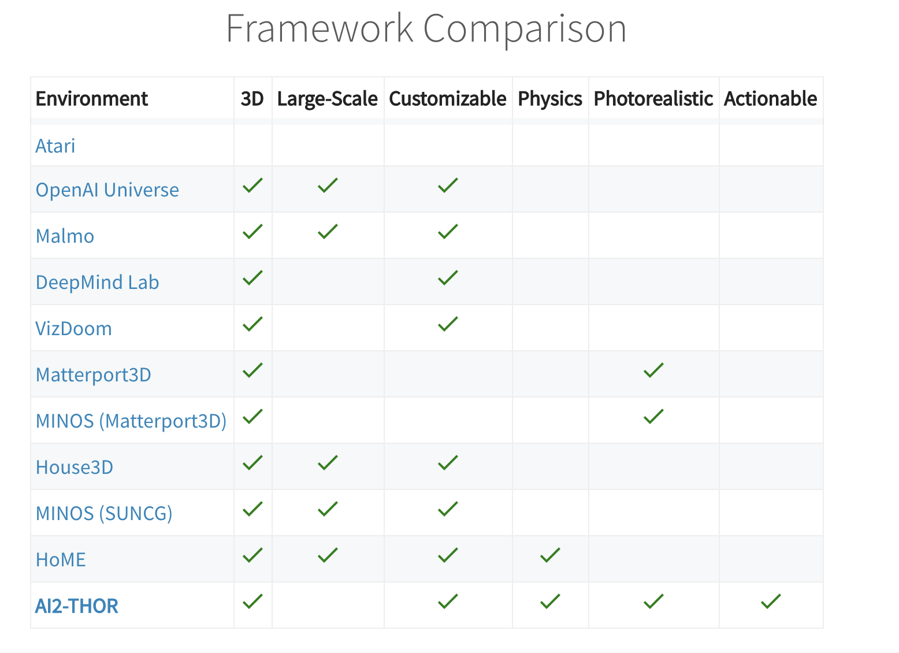

# Environments

<!--TODO: add info on OpenAI Gym, DeepMind Lab,  Malmo-->
<!--TODO: categorise wrappers like OpenAI Gym vs envs like HoME -->

* OpenAI Gym
* DeepMind Lab
* Atari/Arcade Learning Environment (ALE)
    * accessible via OpenAI Gym interface
    * [updated with modes and difficulties in 2017](http://www.marcgbellemare.info/introducing-the-ale-6/)
    * [[code]](https://github.com/mgbellemare/Arcade-Learning-Environment)

<!--TODO: elab on what Gridworlds is -->
* Gridworlds (for AI Safety) 
	- [[code: pycolab]](https://github.com/deepmind/pycolab)
	- [[Paper]](https://arxiv.org/abs/1711.09883)

* Malmo (Microsoft, Minecraft-based)
* Unity Machine Learning Agents
	- [support for curriculum learning in v0.2](https://blogs.unity3d.com/2017/12/08/introducing-ml-agents-v0-2-curriculum-learning-new-environments-and-more/)
* DeepMind Control Suite
	- Continuous control tasks with standardised structure and rewards, intended to serve as performance benchmarks for RL agents.
	- [[Video]](https://www.youtube.com/watch?v=rAai4QzcYbs&feature=youtu.be) [[Paper (Tassa et. al., Jan 2018)]](https://arxiv.org/abs/1801.00690) [[Code]](https://github.com/deepmind/dm_control)

## 3D Home Environments
* HoME (Household Multimodal Environment, 45k 3D houses populated with objects)
	- Supports sound, vison and touch sensing
	- [[Website]](https://home-platform.github.io/) [[Code]](https://github.com/HoME-Platform/home-platform) [[Paper]](https://arxiv.org/abs/1711.11017v1), 
	- OpenAI Gym-compatible
- AI2-THOR: 3D agent-training environment (The House Of inteRactions (Dec 2017)
	- 120 actionable, high quality 'photo-realistic' 3D scenes (rooms in a house)
		- Actions like: pick up mug, put mug in coffee  machine, open fridge.
		- Claim: realistic, interactive scenes mean better transfer of learned models to the real world
	- Scenes are hand-crafted
	- Unity-based with Python API. OS: Mac or Ubuntu.
	- [[Website]](http://ai2thor.allenai.org./)[[Video]](https://www.youtube.com/watch?time_continue=7&v=MvvAhF4HZ8s) [[Paper]](https://arxiv.org/abs/1712.05474)

## For self-driving cars 
- CARLA (Simulator for autonomous driving research, from Intel)
	- 'supports flexible specification of sensor suites and environmental conditions'
	- [[Code]](https://github.com/carla-simulator/carla) [[Paper]](http://proceedings.mlr.press/v78/dosovitskiy17a/dosovitskiy17a.pdf)
- ParallelEye (3D urban environment modelled on Beijing's Zhongguancun region)
	- [[Paper]](https://arxiv.org/abs/1712.08394)
	- Unclear if full dataset exists or if this is just a proposed pipeline
	- Intended for traffic vision research
	- Method: built using much human labour ('constructed the dataset by grabbing the available Open Street Map (OSM) layout data for a 2km x 3km area, then modeled that data using CityEngine, and built the whole environment in the Unity3D engine.' - Import AI #75)
	- Unity

## Platforms (may not quite be environments)
- [MAgent](https://github.com/geek-ai/MAgent)
	- Research platform for many-agent reinforcement learning. (hundreds to millions of agents)

## Sense of touch
- [SenseNet (3D Objects Database and Tactile Simulator)](https://arxiv.org/abs/1801.00361)
	- Simulated MPL robotic hand with touch integrated into one of its simulated physical sensors
	- Can experiment with algorithms that learn to classify objects by touch
	- API similar to OpenAI Gym
	- [[Paper (Dec 2017)]](https://arxiv.org/abs/1801.00361)

## 2D
- [Gym-Maze](https://github.com/zuoxingdong/gym-maze)
	- Easy-to-use maze generator (code for random mazes, Morris water mazes available)
	- [[Code]](https://github.com/zuoxingdong/gym-maze)

## Other resources

*Comparison of environments. Credits: AI2-THOR (possible bias in selection of criteria)*
