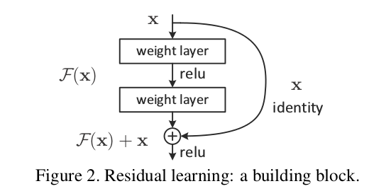

# Glossary

(Work in progress. The focus is on terms that won't be part of most introductory courses since those definitions are easy to find and are usually in the [WildML glossary](http://www.wildml.com/deep-learning-glossary/).)

See also the [basics glossary](basics-glossary.md).

### Frameworks

#### Options framework
- involves abstractions over the space of actions
- at each step, the agent chooses either a one-step 'primitive' action or a 'multi-step' action policy (option). Each option defines a policy over actions (either primitive or other options) and can be terminated according to a stochastic function of $\beta$.
- Paper: Sutton et. al.

Definition from Kulkarni and Narasimhan et. al (2016) 

- Policy gradient methods

### Training methods

- [Backpropagation](basics-glossary.md)
- Synthetic gradients
	- Result: Faster updating of parameter weights
	- Method: Using predicted 'synthetic gradients' (estimate based on local gradient) instead of true backpropagated error gradients
	- [[Paper (Jaderberg et. al., Jul 2017)]](https://arxiv.org/pdf/1608.05343.pdf)

### Models

- A3C (Asynchoronous Advantage Actor-Critic)
	- Actor-critic: 
		- Two outputs: 
			1. Actor: outputs Policy, i.e. Q-values $Q(s,a_i)$ for all $a_i$, possible actions via Softmax
			2. Critic: outputs Value of state we're in $V(s)$
	- Asynchronous
		- Multiple agents tackling the same environment, each initalised differently (diff random seed)
			- More experience to learn from
			- Reduces chance of all agents being stuck in a local max
			- Can combine N nets into one single net,
				- where N = number of agents. 
				- So weights are shared.
		- Agents share experience by contributing to a common critic
	- Advantage
		- Have two losses, one for each output (Value loss, policy loss)
		- Value loss: TODO (fill in)
		- Policy loss: 
			- Let Advantage A = Q(s,a) - V(s)
				- How much better is the Q-value you're selecting compared to the 'known' V value across agents?
			- Goal is to maximise advantage: encourages actions that have Q(s,a) > V.

- A2C (Synchronous A3C: Advantage Actor-Critic)
	- A2C tends to be unstable due to occasional entropy collapse. (AI Safety Gridworlds, Nov 2017)
    - Particularly sensitive to hyperparameter(s) relating to policy entropy
- Rainbow
- Neural Turing Machine
- DQN
- Capsule Networks
	- [TensorFlow implementation](https://github.com/JunYeopLee/capsule-networks)
- Dilated convolutions
	- Convolutions with filter cells that are regularly spaced out.
	- Purpose: Receptive field grows quicker, so can merge more spatial information across input (keeping filter size constant).
- Dilated LSTMs
- Skip connections
	- Mappings (connections) that skip one or more layers.
		- E.g. Adds (a 1x1 convolution of) an earlier layer to the most recent network layer
		- 
			- Image from He et. al., 2015.
	- Component of a 'deep residual layer'
	    - Goal: help network to learn approximate identity layers (if that is what is locally optimal)
	    	- in which case the output of the most recent network layer should be approx 0.
	- Introduced by [He et. al., Dec 2015](https://arxiv.org/pdf/1512.03385.pdf) as part of deep residual networks, winner of ILSVRC 2015.
		- [Useful Stackexchange post](https://stats.stackexchange.com/questions/56950/neural-network-with-skip-layer-connections)
	- Also called *residaul connections*, *shortcut connections*.
- R-CNN (Region-based CNN)
	- Object detection model
	- [[Fast pytorch implementation]](https://github.com/jwyang/faster-rcnn.pytorch) [[Paper (Faster R-CNN, Ren et. al., Jan 2016)]](https://arxiv.org/abs/1506.01497) [[Explanatory blog post]](https://tryolabs.com/blog/2018/01/18/faster-r-cnn-down-the-rabbit-hole-of-modern-object-detection/)
- ResNets
	- ['densely gathers features from previous layers in nthe network and combines them using summation'](https://arxiv.org/abs/1801.05895)
- DenseNets
	- Dense connection structure where each layer is directly connected to all its predecessors
		- -> better information flow and feature reuse
		- -> BUT dense skip connections also bring problems of potential risk of overfitting, parameter redundancy and large memory consumption
	- ['densely gathers features from previous layers in nthe network and combines them using concatenation'](https://arxiv.org/abs/1801.05895)
- [SparseNet](https://arxiv.org/abs/1801.05895)
	- Synthesised from ResNets and DenseNets
	- [[Paper: Sparsely Connected Convolutional Networks (Zhu and Deng et. al., Jan 2018)]](https://arxiv.org/abs/1801.05895)
- Decimation layer
	- Down-sampling, usually either through max-pooling or average pooling
- Autoencoders
- Variational Inference
- Variational Autoencoder
	- Variational Lower Bound
- MCMC (Markov Chain Monte Carlo)
- Gibbs Sampling
- Monte Carlo EM
- EM
- Wake-sleep
- MAP
- Boltzmann Machines
- Linear Factor Models
    - Independent Component Analysis (ICA)
    - Sparse Coding
- NADE
- MADE
- PixelCNN
	- PixelCNN++
- PixelRNN
- More architectures
	- VGG16
	- ResNeXt
	- Feature Pyramid Networks
- Evolution Strategies
	- [[Basic Tutorial]](https://medium.com/@edersantana/mve-series-playing-catch-with-keras-and-an-evolution-strategy-a005b75d0505) [[OpenAI post]](https://blog.openai.com/evolution-strategies/)
- Bayesian NNs
- Nested LSTM
	- Use nesting as an approach to constructing temporal hierarchies in memory
	- **selective access to inner memories** -> frees inner memories to remember and process events on longer time scales
	- [[Paper (Moniz et. al., Jan 2018)]](https://arxiv.org/abs/1801.10308)

### Reinforcement Learning
- Intuition of RL: 
	- Loop through two steps:
		- Agent performs action. 
		- State may change, agent may get reward.
	- Agent explores the environment by taking actions.
	- Actions involve time
	- Don't pre-program procedures in agent, but agent knows list of actions
- Bellman Equation
	- $V(s) = \max{a}(R(s,a)+\gamma E[V(s')])$
		- where $\gamma$ is the discount factor.
		- Deterministic version: $V(s) = \max{a}(R(s,a)+\gamma V(s'))$
		- Expanded for MDPs: $V(s) = \max{a}(R(s,a)+\gamma \sum_{s'} P(s,a,s')V(s'))$
- Plans vs Policies: 
	- Plans comprise the optimal action for each state, with no stochasticity. Policies incorporate stochasticity.
- Deterministic vs non-deterministic search:
	- Deterministic search: Agent's intention maps 100% to agent's action.
	- Non-deterministic search: Small chance of agent acting differently to how it intends to act
- Markov Decision Processes (MDP)
	- Mathematical framework for modelling decision-making where outcomes are partly random and partly under the control of a decision-maker
	- Markov Property: 
		- Memorylessness: Conditional P(X) dist depends only on present state
	- Associated Bellman eqn: $V(s) = \max{a}(R(s,a)+\gamma E[V(s')])$
		- aka $V(s) = \max{a}(R(s,a)+\gamma \sum_{s'} P(s,a,s')V(s'))$
- Q-learning
	- Give values to actions $Q(s_0,a_i)$ instead of states
		- $Q(s,a) = R(s,a)+\gamma \sum_{s'} P(s,a,s')V(s')$
			- i.e. $Q(s,a) = R(s,a)+\gamma \sum_{s'} P(s,a,s')\max{a'}Q(s',a')$
- Temporal Difference
	- TODO: refine
	- (Consider Q-learning under deterministic search for convenienc)
	- $TD_t(a,s) = Q_t(s,a) - Q_{t-1}(s,a) = R(s,a)+\gamma\max{a'}Q(s',a') - Q_{t-1}(s,a)$
	- $TD(a,s)$ may be nonzero because of randomness. (Though we've *written* the deterministic search version of )
- Update eqn: $Q_t(s,a) = Q_{t-1}(s,a) + \alpha TD_t(a,s)$
	- $\alpha$ is the learning rate.
	- Hope: algorithm will converge to the 'correct' Q-value, unless the environment is constantly changing.
- Living penalty
    - e.g. small negative reward when entering each non-terminal state to motivate agent to finish the game quickly

### Deep RL
- Deep Q-learning
	- **Learning**: Feed in state to NN, final layer gives q-values for each action
		- Compares predicted value to previous observed value: loss $L = \sum(Q_{prev_observed} - Q_{pred})
<!--			- TODO: but what if you haven't seen this state before?
			- TODO: What if you've seen it multiple times?
-->
		- Learning happens for each state
	- **Acting**: Put final layer through softmax (or some other action selection policy, see below) and select the corresponding action.
- Experience replay
	- Problem: Update after every action, so consecutive states that are similar may bias the neural network.
	- Solution: Save state information. Start updating after some initial time period, and update with states drawn uniformly from memory in the interval $(t-k_1, t-k_2)$.
	- [Schaul et al. (2016), Prioritized Experience Replay](#)
- Action selection policies
	- Most commonly used:
		- $\epsilon$-greedy
			- Select highest q-value action $(1-\epsilon)$ of the time, randomly otherwise.
				- Tokic (2010): can adapt $\epsilon$ depending on the state (smaller $\epsilon$ if the agent is certain about its state)
		- $\epsilon$-soft $(1-\epsilon)$
			- Opposite of $\epsilon$-greedy: select highest q-value action $\epsilon$ of the time, randomly otherwise.
		- Softmax
			- $\sigma(\textbf{z})_j = \frac{e^{z_j}}{\sum_k e^{z_k}}$ for $j=1,...,K$.
			- Outputs across all actions sum to one
	- Key is exploration vs exploitation
		- Agent may find itself stuck in a local maximum (thinks e.g. a positive-reward action $Q_2$ is the best action because it hasn't found the better one $Q_4$.)
- Policy Gradient Methods
	- General Challenges
		- Sensitive to choice in stepsize
		- Often have poor sample efficiency, taking millions or billions of steps to learn simple tasks
		- Approaches:
			- constraining or optimising size of policy update
	- Trust Region Policy Optimisation (TRPO)
		- [[Implementation in PyTorch]](https://github.com/ikostrikov/pytorch-trpo)
		- Pros
			- Good for continuous control tasks
		- Cons
			- 'isn’t easily compatible with algorithms that share parameters between a policy and value function or auxiliary losses'
	- Proximal Policy Optimisation (PPO)
		- Tries to minimise cost while ensuring the deviation from the previous policy is relatively small
		- Implementation:
			- $L^{CLIP}(\theta) = \hat{E_t}[\min(r_t(\theta)\hat{A_t},\clip(r_t(\theta),1-\epsilon,1+\epsilon)\hat{A_t})]
				- $r_t$: ratio of probability under new and old policies respectively (?) check
				- $\hat{A_t}$: estimated advantage at time t
				- $\epsilon$: hyperparameter, usually 0.1 or 0.2
			- Much simpler to implement than ACER 
			- Trust region update compatible with SGD
		- [OpenAI blog post](https://blog.openai.com/openai-baselines-ppo/)
	- PPO2
		- GPU-enabled implementation of PPO by OpenAI.
	- Actor Critic with Experience Replay (ACER)
		- Sample-efficient ploicy gradient algorithm
		- Uses a replay buffer, so it can perform more than one gradient update using each piece of sampled experience, as well as a Q-Function approximate trained with the Retrace algorithm.
	- References:
		- [OpenAI blog post on PPO](https://blog.openai.com/openai-baselines-ppo/)

#### References:
- RL: AI A to Z course