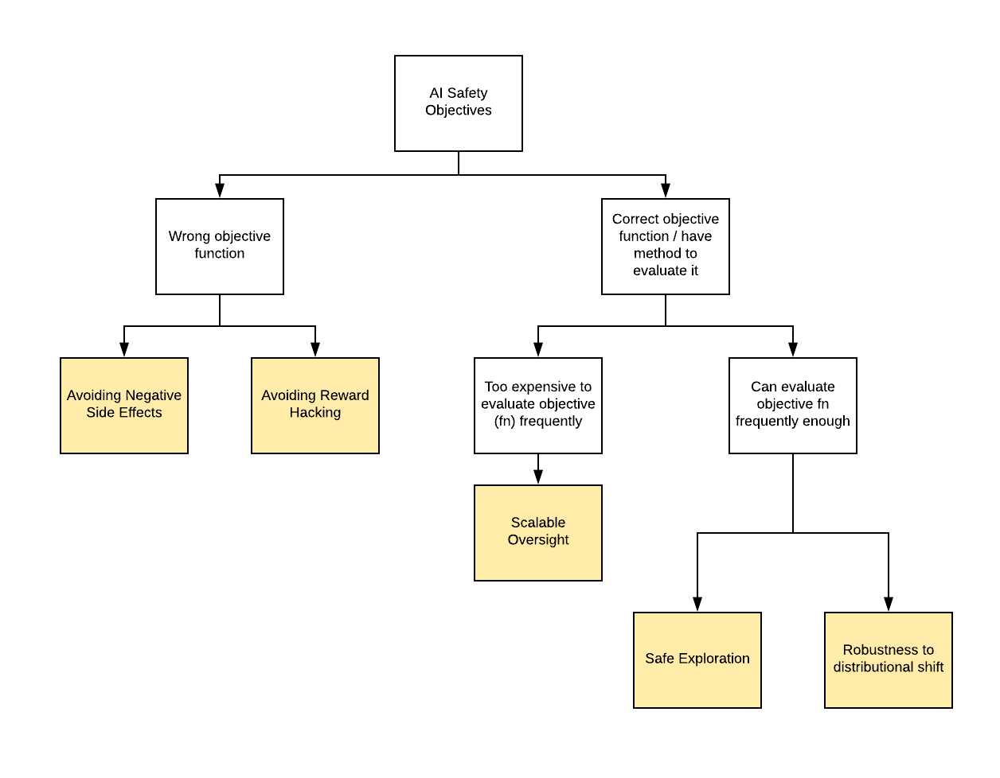

# Concrete Problems in AI Safety

Amodei and Olah et. al., Jul 2016

[[arxiv]](https://arxiv.org/abs/1606.06565) [[Open AI blog post]](https://blog.openai.com/concrete-ai-safety-problems/)

**Tags**: 
- AI Safety
- Reinforcement Learning

## Summary

Discusses five areas (objectives) for AI safety research:
1. [Avoiding negative side effects](#i-avoiding-negative-side-effects)
2. [Avoiding Reward Hacking](#ii-avoiding-reward-hacking)
3. Scalable Oversight
	- TODO: add brief explanation
4. Safe exploration
5. Robustness to distributional shift
	- between train and test

<!--
- Wrong objective function
- Correct objective function, have method to evaluate it
-->
For each area, they discuss the research problems, current and promising approaches and potential experiments to conduct.

(Work in progress: writing much more detailed summary)

## Detailed summary

### Why we need to address these problems
1. Increasing promise of reinforcement learning (RL), which allows agents to have **highly intertwined interactions with the environment**.
2. Trend towards more complex agents and environments
	- Increases probability of side effects occcuring
	- Agent may need to be sufficiently complex to hack rewards
3. Trend towards increased autonomy of AI systems
	- (in terms of action space in the real world, i.e. directly controlling industrial processes vs outputting recommendations to users)
	- Increases potential harm caused by systems that humans cannot necesarily correct or oversee

### I. Avoiding negative side effects

#### Difficulties:
- Not feasible to identify and penalise every possible disruption

#### Approaches
1. Using impact regularisers
	- impact regularisers: penalise changes to environment.
	1. Define impact regulariser
		- Examples of measures of changes to environment:
			- Naive: state distance
				- BUT agent will try to prevent 'natural' evolution of the environment
			- Distance between future state under agent's policy and future state under a reference policy 
				- Can be v sensitive to (1) representation of state and (2) distance metric.
				- Reference policy examples:
					- 'Null' policy: where agent acts passively 
						- (May be hard to define if starting point is e.g. agent carrying a heavy box, where doing nothing is not a passive action)
					- 'Known safe' policy
	2. Learn impact regulariser
		- Learn via training over many tasks (transfer learning)
			- since side effects may be more similar across tasks than the main goals
			<!-- 
			- Separating side effect components from main tasks may speed up transfer learning.
			- (Similar to model-based RL approaches that attempt to transfer a learned dynamics model but ...) 
			-->
2. Penalise influence
	- Prefer agent not to get into a position where it could easily do things which have side effects.
	- Measures of influence (mostly info theoretical):
		- Empowerment
			- := max possible mutual information between agent's potential future action and its potential future state
				= Shannon capacity of channel between agent's actions and the environment.
			- BUT empowerment measures precisions of control over the environment vs total impact.
			- **Research direction (RD)**: Explore variants of empowerment  (TODO: fill in)
3. Multi-agent approaches
	- Understanding other agents and make sure actions don't harm their interests
		- Since avoiding negative side effects is a proxy for avoiding negative externalities
	- Approaches
		- Cooperative Inverse Reinforcement Learning
		- Reward autoencoders
4. Reward uncertainty

Potential experiments:
1. Avoid obstacles (e.g. don't break vases) while accomplishing a single goal.

### II. Avoiding Reward Hacking

Examples of ways reward hacking can happen:
- Closing eyes (don't sense mess) vs cleaning mess up
- Genetic algorithms

#### Ways problems can occur
1. Partially observed goals
	- Agent can only confirm subset of external world through imperfect perception
	- -> Design rewards that represent partial/imperfect measures
	- -> Can be hacked.
		- Though in theory can show there exist rewards as a fn of observations and actions equivalent to optimising true objective function via reducing POMDP to belief state MDP.
2. Complicated Systems
	- Probability that there exists a viable hack increases with agent complexity
		- // bugs in software as complexity of codebase increases
3. Abstract Rewards
	- Sophisticatd reward functions use abstract concepts
	- These may have to be learned by models like neural nets
	- which may be vulnerable to adverse counterexamples <!-- Ok, so? -->
4. Correlation between objective function and accomplishing tasks broken
	- Goodhart's Law
		- 'When a metric is used as a target, it ceases to be a good metric.'
		- Correlation between obj fn and accomplishing task breaks down when obj fn is highly optimised.
			- e.g. using amount of bleach used as a proxy for amount of cleaning done.
	- Feedback Loop
		- Correlation breaks because obj fn has a self-amplifying component.
			- May magnify transient success to perpetual success
5. Environmental Embedding (Hardware)
	- Tampering with reward implementation
	- Often called 'wireheading'
	- Especially concerning if humans are in the loop (may harm or coerce humans to get reward)

<!-- ## Thoughts

## Related papers

-->