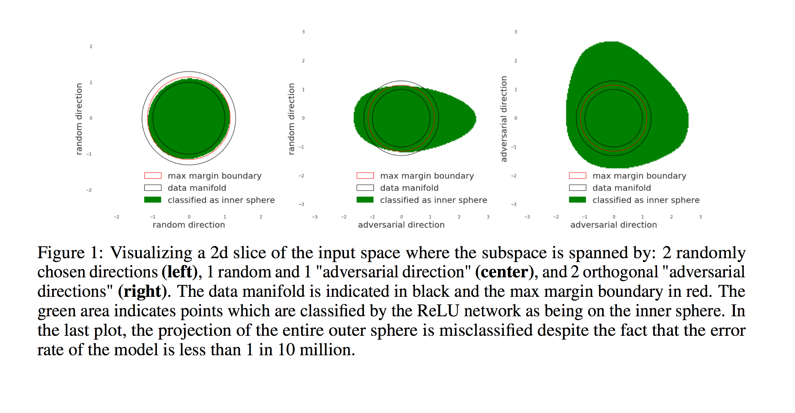

# Adversarial Spheres

Gilmer et. al., Jan 2018

Authors: Justin Gilmer, Luke Metz, Fartash Faghri, Samuel S. Schoenholz, Maithra Raghu, Martin Wattenberg, Ian Goodfellow

[[arxiv]](https://arxiv.org/abs/1801.02774)

**Tags**: 
- Adversarial examples

## Summary

The authors hypothesise that current computer vision models' **vulnerability to small adversarial perturbations of the input is a naturally occurring result of the high-dimensional geometry of the data manifold**.

Specifically, they study **a toy problem of classifying between two concentric high-dimensional spheres of radius 1 and R** (i.e. there is a simple correct decision boundary, see max margin boundary in image below). 
* They show a tradeoff between test error and average distance to nearest error (misclassified datapoint).
* They prove that any model which misclassifies a small constant fraction of a sphere will be vulnerable to adversarial perturbations of size O(1/\sqrt(d)).
* Neural networks trained approach this bound.

## Notes
Note that (1) the adversarial examples lie on the data manifold and (2) the theorem proven is for all models, not just neural networks.

Surprisingly, even when neural networks are restricted to learning elliptical decision boundaries, they often learn strange ones:

#### Relevance:
In state-of-the-art computer vision models, most images in the data distribution are both correctly classified by the model and close to a visually similar misclassified image (and are thus susceptible to adversarial perturbations).

Date updated: 19 Feb 2018